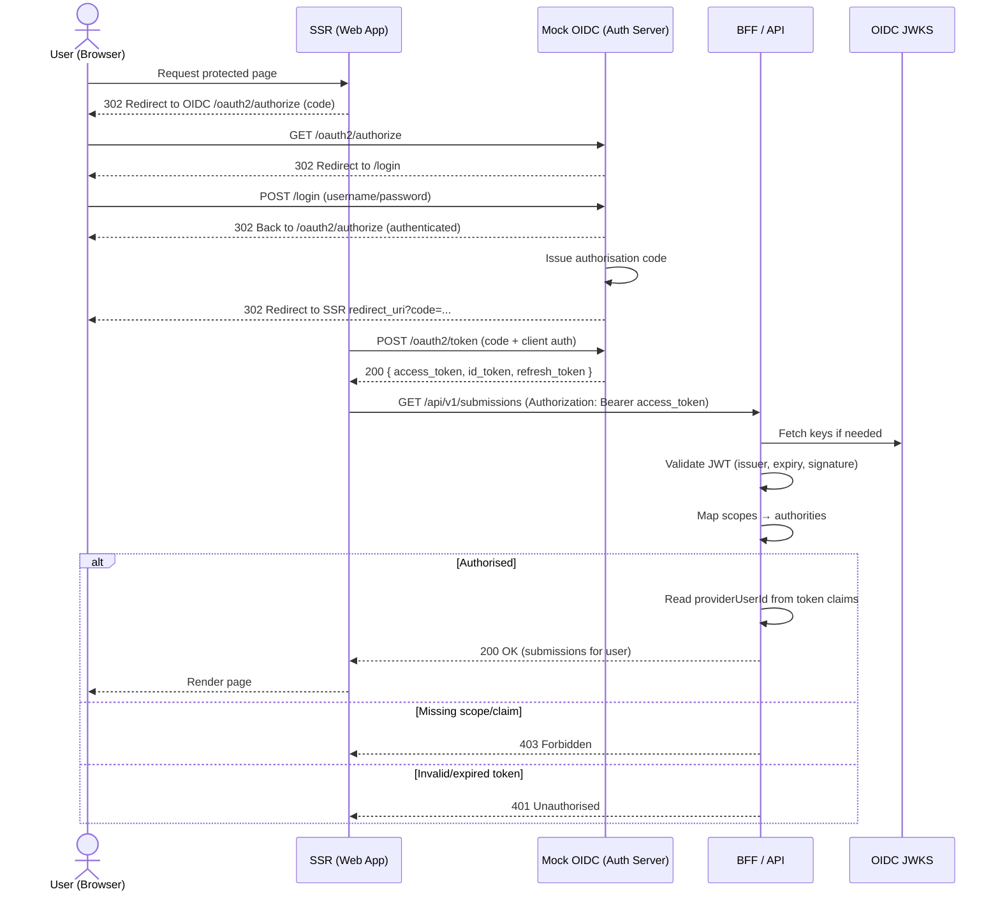

# "Mock" OIDC Server for testing authentication and authorisation

This is a real Spring auth server implementation that can be used in an OIDC flow by both front end (SSR) and backend (BFF) for authentication and authorisation. It includes an in-memory user-details manager with some test users set up with different ids including providerUserId to reflect multiple personas. Each user contains data supplied as claims:

### ID Token
- name
- preferred_username
- email
- providerId
- providerUserId

### Access Token (sent as JWT to BFF)
- providerId
- providerUserId

## Authentication & Authorisation Flow using mock oidc

This file explains how authentication and authorisation work across the **Mock OIDC (Spring Authorisation Server)**, the **SSR (web app)**, and the **BFF/API (resource server)**. 

---

## Components & Key Classes

- **Mock OIDC (Authorisation Server)** — `OidcServerConfig` (Spring Authorization Server)
  - `authorizationServer(HttpSecurity, Map<String, TestUser>)` — exposes OIDC/OAuth2 endpoints (discovery, authorise, token, jwks, userinfo) and routes unauthenticated users to `/login`.
  - `application(HttpSecurity)` — serves the login form and protects app routes.
  - `registeredClientRepository(PasswordEncoder)` — registers `ssr-client` and `machine` clients.
  - `authorizationServerSettings()` — sets the **issuer** (must match tokens’ `iss` and BFF `issuer-uri`).
  - `jwkSource()` — RSA keys for JWT signing (exposed at `/oauth2/jwks`).
  - `users(PasswordEncoder)` — in-memory users (e.g. `alice`, `bob`) for interactive login.
  - `tokenCustomizer(Map<String, TestUser>)` — adds custom claims to **ID** and **Access** tokens.
  - `TestUser` record and `testProfiles()` — in-memory profile data used by UserInfo and token claims.

- **SSR (OAuth2 Client)** — Spring Security OAuth2 Client auto-configuration (in SSR app)
  - Configuration-only (e.g. `application.yml`) defines provider/registration for `ssr-client`.
  - Handles browser redirect to `/oauth2/authorize` and code → token exchange.

- **BFF/API (Resource Server)** — Spring Security Resource Server
  - `SecurityFilterChain` — sets `.oauth2ResourceServer().jwt()` so Bearer JWTs are validated.
  - Application config sets `spring.security.oauth2.resourceserver.jwt.issuer-uri`.
  - Controllers read claims from `Jwt` (e.g. `providerUserId`) and enforce scopes/roles.

---

## Real‑World User Journey (Browser)

### Step 1 — User requests a protected SSR page
- **What happens:** SSR detects no session and redirects to the Authorisation Server.
- **Code involved (SSR):**
  - Spring Security OAuth2 Client **configuration only** (no custom code required). Example:

    ```yaml
    spring:
      security:
        oauth2:
          client:
            provider:
              mock:
                issuer-uri: http://localhost:8081/mock-issuer
            registration:
              ssr:
                provider: mock
                client-id: ssr-client
                client-secret: secret
                authorization-grant-type: authorization_code
                redirect-uri: "{baseUrl}/login/oauth2/code/ssr"
                scope: openid,profile,email,api.read
    ```

### Step 2 — Browser arrives at `/oauth2/authorize` → redirected to `/login`
- **What happens:** The Authorisation Server’s endpoints require authentication and send unauthenticated users to the login form.

- **Code involved (Mock OIDC):**
  - `authorizationServer(HttpSecurity, ...)`:

    ```java
    var as = OAuth2AuthorizationServerConfigurer.authorizationServer();
    http.securityMatcher(as.getEndpointsMatcher())
        .exceptionHandling(ex -> ex.authenticationEntryPoint(
            new LoginUrlAuthenticationEntryPoint("/login")))
        .with(as, cfg -> cfg.oidc(oidc -> oidc.userInfoEndpoint(ui -> ui.userInfoMapper(...))))
        .authorizeHttpRequests(a -> a.anyRequest().authenticated())
        .oauth2ResourceServer(o -> o.jwt()); // /userinfo accepts Bearer
    ```
  - `application(HttpSecurity)` renders and processes the form login:

    ```java
    http.authorizeHttpRequests(a -> a
          .requestMatchers("/login","/css/**","/js/**").permitAll()
          .anyRequest().authenticated())
        .formLogin();
    ```
  - `users(PasswordEncoder)` provides in-memory users (e.g. `alice/password`).

### Step 3 — Authorisation **code** is issued and browser is redirected to SSR
- **What happens:** After successful login, the Authorisation Server validates the request and redirects the browser to the SSR `redirect_uri` with a `code`.

- **Code involved (Mock OIDC):**
  - `registeredClientRepository(...)` registers the `ssr-client` with redirect URI and scopes:

    ```java
    RegisteredClient ssr = RegisteredClient.withId(UUID.randomUUID().toString())
      .clientId("ssr-client")
      .clientSecret(encoder.encode("secret")) // {noop}secret for dev if preferred
      .clientAuthenticationMethod(ClientAuthenticationMethod.CLIENT_SECRET_BASIC)
      .authorizationGrantType(AuthorizationGrantType.AUTHORIZATION_CODE)
      .authorizationGrantType(AuthorizationGrantType.REFRESH_TOKEN)
      .redirectUri("http://localhost:8080/login/oauth2/code/ssr")
      .scope(OidcScopes.OPENID).scope(OidcScopes.PROFILE).scope(OidcScopes.EMAIL)
      .scope("api.read")
      .build();
    ```
  - `authorizationServerSettings()` sets the **issuer** used inside tokens.

### Step 4 — SSR exchanges the **code** for **tokens** (server-to-server)
- **What happens:** The SSR calls `/oauth2/token` with the code and client credentials.

- **Code involved:**
  - **SSR**: Spring Security OAuth2 Client auto-exchange (no custom code required).
  - **Mock OIDC**: Token endpoint provided by `authorizationServer(...)`; keys provided by `jwkSource()`; **custom claims** by `tokenCustomizer(...)`.

    ```java
    @Bean
    OAuth2TokenCustomizer<JwtEncodingContext> tokenCustomizer(Map<String, TestUser> profiles) {
      return ctx -> {
        var u = profiles.get(ctx.getPrincipal().getName());
        if (u == null) return;
        if (OidcParameterNames.ID_TOKEN.equals(ctx.getTokenType().getValue())) {
          ctx.getClaims().claim("name", u.displayName())
            .claim("preferred_username", u.username())
            .claim("email", u.email())
            .claim("providerId", u.providerId())
            .claim("providerUserId", u.providerUserId());
        }
        if (OAuth2TokenType.ACCESS_TOKEN.equals(ctx.getTokenType())) {
          ctx.getClaims().claim("providerId", u.providerId())
            .claim("providerUserId", u.providerUserId().toString());
        }
      }; 
    }
    ```
### Step 5 — SSR calls the **BFF/API** with `Authorization: Bearer <access_token>`
- **What happens:** The BFF validates the token and authorises the request by scopes/claims.

- **Code involved (BFF):**
  - Resource server configuration (YAML):

    ```yaml
    spring:
      security:
        oauth2:
          resourceserver:
            jwt:
              issuer-uri: http://mock-oidc:8081/mock-issuer

    ```
  - `SecurityFilterChain` enabling JWT support:

    ```java
    http.authorizeHttpRequests(a -> a
          .requestMatchers("/swagger-ui.html","/swagger-ui/**","/v3/api-docs/**","/actuator/**").permitAll()
          .anyRequest().authenticated())
        .oauth2ResourceServer(o -> o.jwt());
    ```
  - Controller using claims for data isolation:

    ```java
    @GetMapping("/api/v1/submissions")
    @PreAuthorize("hasAuthority('SCOPE_api.read')")
    public ResponseEntity<List<Submission>> mine(@AuthenticationPrincipal Jwt jwt,
                                                 @RequestParam(defaultValue="false") boolean includeTotals) {
      String id = jwt.getClaimAsString("providerUserId");
      UUID providerUserId = UUID.fromString(id);
      return ResponseEntity.ok(claimService.getAllSubmissionsForProvider(providerUserId, includeTotals));
    }

    ```    

## What the BFF must be configured to trust

```yaml
# BFF (resource server) application config
spring:
  security:
    oauth2:
      resourceserver:
        jwt:
          issuer-uri: http://mock-oidc:8081/mock-issuer
```

- The BFF should **not** accept user IDs in “my data” endpoints; it must derive identity from the token (e.g. `providerUserId` claim).
- For admin/support endpoints that read arbitrary users, place the ID in the path and protect with strong roles (e.g. `ROLE_ADMIN`) or a self‑check helper.

---

## Token Design (practical notes)

- Put **authorisation‑relevant** attributes in the **access token** (e.g. `providerUserId`, roles/permissions, or rely on OAuth scopes such as `api.read`).
- Keep sensitive or verbose identity attributes in the **ID token** for UI use only.
- Claims should be stable, minimally sufficient, and not personally identifiable beyond what’s required for access control in development.

---

## Manual Simulation (Local Dev)

This section mirrors the real flow but uses a **browser** to log in and **curl** to exchange the code and call the BFF.

### Key endpoints (from discovery)
- Authorise: `http://localhost:8081/mock-issuer/oauth2/authorize`
- Token: `http://localhost:8081/mock-issuer/oauth2/token`
- JWKS: `http://localhost:8081/mock-issuer/oauth2/jwks`

### A) Start authorisation in the browser
Open:
```
http://localhost:8081/mock-issuer/oauth2/authorize
  ?response_type=code
  &client_id=ssr-client
  &redirect_uri=http://localhost:8080/login/oauth2/code/ssr
  &scope=openid%20profile%20email%20api.read
  &state=dev123
  &nonce=dev123
```
Log in (e.g. `alice/password`). Copy the `code` query parameter from the SSR redirect URL.

### B) Exchange the code for tokens (on the laptop with `curl`)
**Option 1 — `client_secret_basic`**
```bash
CODE='<paste the code from the browser>'

curl -s -u ssr-client:secret   -H 'Content-Type: application/x-www-form-urlencoded'   -d 'grant_type=authorization_code'   -d "code=$CODE"   -d 'redirect_uri=http://localhost:8080/login/oauth2/code/ssr'   http://localhost:8081/mock-issuer/oauth2/token | jq
```

**Option 2 — `client_secret_post`** *(only if allowed on the client)*
```bash
curl -s -H 'Content-Type: application/x-www-form-urlencoded'   -d 'grant_type=authorization_code'   -d "code=$CODE"   -d 'redirect_uri=http://localhost:8080/login/oauth2/code/ssr'   -d 'client_id=ssr-client'   -d 'client_secret=secret'   http://localhost:8081/mock-issuer/oauth2/token | jq
```

The response includes `access_token` (Bearer JWT), `id_token`, optional `refresh_token`, etc.

### C) Call the BFF/API with the access token
```bash
TOKEN='<paste .access_token>'
curl -i   -H "Authorization: Bearer $TOKEN"   'http://localhost:8080/api/v1/submissions?includeTotals=true'
```

### D) (Optional) Inspect token claims locally
```bash
# Linux
echo "$TOKEN" | cut -d. -f2 | tr '_-' '/+' | base64 -d 2>/dev/null | jq

# macOS
echo "$TOKEN" | cut -d. -f2 | tr '_-' '/+' | base64 -D 2>/dev/null | jq
```

---

## Troubleshooting

- **Redirect URI mismatch:** the `redirect_uri` in the token request must match the registered value **exactly**.
- **Client authentication failed:** prefer `client_secret_basic` with `-u ssr-client:secret`; for local dev, `{noop}secret` can simplify setup.
- **Issuer mismatch (401 from BFF):** the BFF’s `issuer-uri` must equal the token’s `iss`. In Docker, that typically includes the service name (`http://mock-oidc:8081/mock-issuer`).
- **Reused/expired code:** obtain a **fresh code** if the exchange fails.
- **403 from BFF:** token valid but missing authority; ensure requested scopes match what the BFF enforces (e.g. `api.read`).

---

## Summary

- The **SSR** drives the browser login and code exchange, then calls the **BFF** with a **Bearer access token**.
- The **BFF** validates the token against the **Mock OIDC** issuer and authorises by scopes/claims.
- For “my data” endpoints, user identity is derived from token claims (no IDs in URLs). Admin endpoints use explicit IDs and stronger roles.


